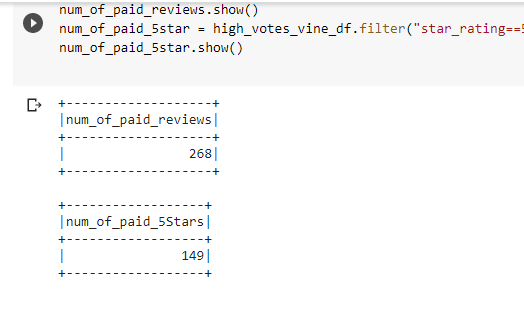
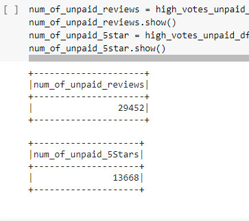
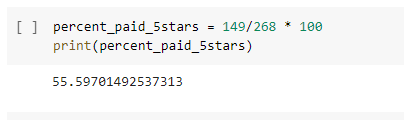
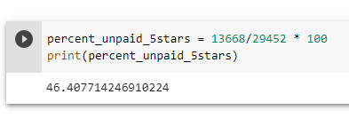

# Amazon_Vine_Analysis

## Overview of the analysis

##### This analysis is aimed at determining whether there is a bias towards positive review when products or services are offered free in return for a review. The data set used is from Amazon and reviews from the vine program are indicated.

## Results

##### The results of the analysis are the following:

* Total number of Vine (paid) reviews are 268
* Total number of unpaid reviews are 29452
* Total number of Vine (paid) 5-star ratings are 149
* Total number of unpaid 5-star ratings are 13668
* Percentage of Vine reviews that were 5-stars is 55.60%
* Percentage of unpaid reviews that were 5-stars is 46.41%

 
 

## Summary

The result above shows a positivity bias for review in the vine program as 55.5% of the reviews were 5-stars while only 46.41% of unpaid reviews were 5-stars. This is also an indication that product reviews may not be entirely reliable due to this bias.
